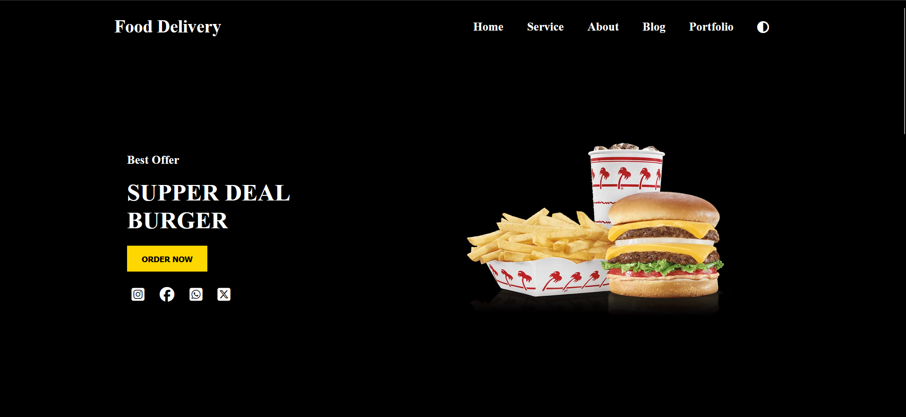
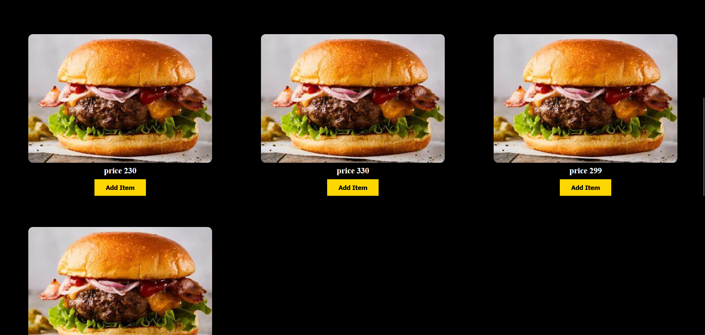
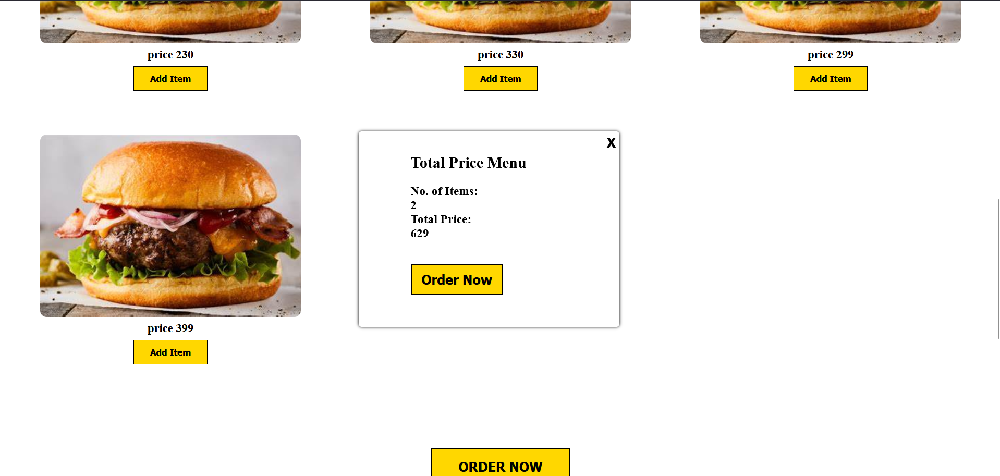
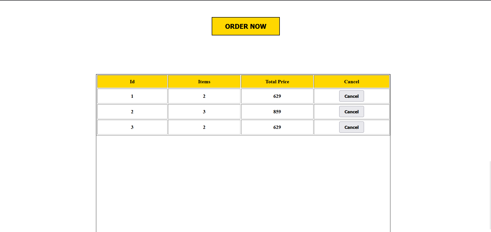

# FoodDelivery

Food Delivery Web Application: Key Features and Technologies
Core Features:

    Menu Display: Displays a comprehensive list of food items, categorized by cuisine or type.
    Order Placement: Enables users to select items, customize orders (e.g., add toppings, specify dietary preferences), and proceed to checkout.
Technologies Used:

    HTML: The foundation of the web application, structuring the content and layout.
    CSS: Used for styling the visual elements, ensuring a visually appealing and user-friendly interface.
    JavaScript: Handles client-side interactions, such as form validation, dynamic content updates, and AJAX requests.
    JSON: A lightweight data-interchange format used to store and transmit data between the client and server.
    Server-Side Technology (Optional): If the application requires backend functionality (e.g., database management, order processing), a server-side language like PHP, Python, or Node.js can be used.

